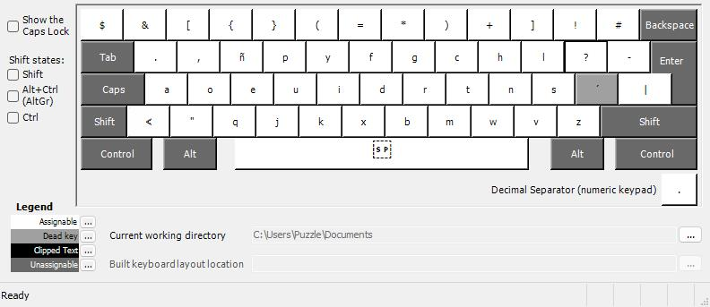
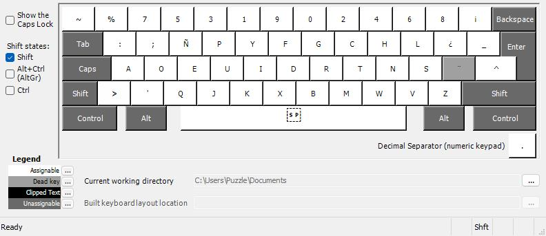
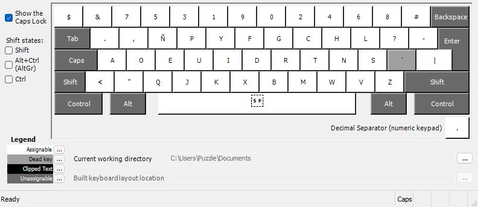
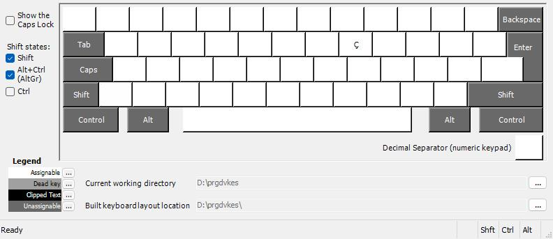

# Dvorak Programmer ES ISO for Windows

[Go to English](#english) | [Ir a Español](#español)

---

## English

### 📋 Description

This directory contains all the necessary files to install the **Programmer Dvorak ES ISO** keyboard layout on Windows systems. The layout has been created using **Microsoft Keyboard Layout Creator (MSKLC) 1.4** and is fully compatible with Windows 7, 8, 10, and 11.

### 📁 Files Included

-   **`spanish-programmer-dvorak.klc`** - Source file for Microsoft Keyboard Layout Creator 1.4
    -   Editable with MSKLC
    -   Contains the complete layout definition
    -   Can be modified to create custom variations
-   **`dist.zip`** - Pre-built installation package
    -   Contains compiled DLL files
    -   Includes Windows installer
    -   Ready to install without requiring MSKLC
-   **`images/`** - Layout reference images
    -   Visual representation of all key combinations
    -   Useful for learning the layout

### 🚀 Installation Methods

You have two options to install the layout:

#### Option 1: Quick Installation (Recommended)

This is the easiest method for most users.

1. **Download and extract** the pre-built installer:

    ```
    Extract dist.zip to a temporary folder
    ```

2. **Run the installer**:

    - Navigate to the extracted folder
    - Double-click on `setup.exe`
    - Follow the installation wizard
    - Click "Install" and wait for completion

3. **Restart your computer** (required for Windows to recognize the new layout)

4. **Activate the layout**:
    - Go to **Settings** → **Time & Language** → **Language**
    - Click on **Spanish (Spain)** or your preferred language
    - Click **Options**
    - Under **Keyboards**, click **Add a keyboard**
    - Select **Spanish (Programmer Dvorak)**

#### Option 2: Build from Source (Advanced)

Use this method if you want to modify the layout or don't trust pre-built binaries.

**Prerequisites:**

-   Download and install [Microsoft Keyboard Layout Creator 1.4](https://www.microsoft.com/en-us/download/details.aspx?id=102134)

**Steps:**

1. **Open the source file**:

    - Launch Microsoft Keyboard Layout Creator 1.4
    - Go to **File** → **Load Source File**
    - Select `spanish-programmer-dvorak.klc`

2. **Build the installer**:

    - Go to **Project** → **Build DLL and Setup Package**
    - Choose an output directory
    - Wait for the build to complete

3. **Install the layout**:

    - Navigate to the output directory
    - Double-click `setup.exe`
    - Follow the installation wizard

4. **Restart your computer** and activate the layout as described in Option 1, step 4

### 🎨 Layout Reference

The layout includes multiple layers accessible through modifier keys:

#### Base Layer (No modifiers)



Most commonly used letters and punctuation marks.

#### Shift Layer



Uppercase letters and numbers (0-9). In Programmer Dvorak, numbers require Shift.

#### AltGr Layer (Right Alt)


Spanish special characters (á, é, í, ó, ú, ñ, ü) and programming symbols.

#### Caps Lock Layer



Uppercase letters with Caps Lock enabled.

#### Shift + AltGr Layer



Additional special characters and symbols (€, ©, ®, ™, £, etc.).

### 🎯 Key Highlights

-   **Programming-optimized**: Common symbols like `[]{}()<>` are easily accessible without Shift
-   **Numbers with Shift**: Numbers require Shift, freeing up the top row for symbols (typical Programmer Dvorak behavior)
-   **Spanish characters**: Full support for á, é, í, ó, ú, ñ, ü via AltGr combinations
-   **Special symbols**: Extended characters like €, ©, ®, ™, £ available with Shift+AltGr
-   **ISO layout**: Designed for European/Spanish physical keyboards with 105 keys

### 🔧 Customization

If you want to modify the layout:

1. Open `spanish-programmer-dvorak.klc` in Microsoft Keyboard Layout Creator 1.4
2. Make your desired changes to key mappings
3. Save the file (optionally with a new name)
4. Build and install following Option 2 above

### ❓ Troubleshooting

#### Layout doesn't appear after installation

-   Make sure you restarted your computer after installation
-   Check if the layout appears in **Settings** → **Language** → **Keyboard**
-   Try logging out and logging back in

#### Installation fails

-   Run the installer as Administrator (right-click → Run as administrator)
-   Disable antivirus temporarily (some may flag keyboard installers)
-   Make sure you have sufficient permissions to install software

#### Can't uninstall the layout

-   Go to **Settings** → **Time & Language** → **Language**
-   Select the language containing the layout
-   Click **Options** → **Keyboards**
-   Select the layout and click **Remove**
-   Then uninstall via **Control Panel** → **Programs and Features**

#### Characters don't match the images

-   Verify you selected the correct layout (Spanish Programmer Dvorak)
-   Make sure your physical keyboard is ISO layout (European/Spanish)
-   Check if another keyboard layout is interfering

### 🗑️ Uninstallation

To remove the layout from your system:

1. **Remove from active keyboards**:

    - Go to **Settings** → **Language** → **Keyboard**
    - Remove the Spanish (Programmer Dvorak) keyboard

2. **Uninstall the software**:

    - Open **Control Panel** → **Programs and Features**
    - Find "Spanish (Programmer Dvorak)" in the list
    - Click **Uninstall**

3. **Restart your computer** to complete the removal

### 🔄 Switching Between Layouts

Once installed, you can quickly switch between keyboard layouts using:

-   **Windows + Space**: Cycle through all installed layouts
-   **Alt + Shift**: Alternative keyboard switcher (if enabled)
-   **System Tray**: Click the language indicator and select the desired layout

---

## Español

### 📋 Descripción

Este directorio contiene todos los archivos necesarios para instalar la distribución de teclado **Programmer Dvorak ES ISO** en sistemas Windows. La distribución ha sido creada usando **Microsoft Keyboard Layout Creator (MSKLC) 1.4** y es totalmente compatible con Windows 7, 8, 10 y 11.

### 📁 Archivos Incluidos

-   **`spanish-programmer-dvorak.klc`** - Archivo fuente para Microsoft Keyboard Layout Creator 1.4
    -   Editable con MSKLC
    -   Contiene la definición completa del layout
    -   Puede modificarse para crear variaciones personalizadas
-   **`dist.zip`** - Paquete de instalación pre-compilado
    -   Contiene archivos DLL compilados
    -   Incluye instalador para Windows
    -   Listo para instalar sin necesidad de MSKLC
-   **`images/`** - Imágenes de referencia del layout
    -   Representación visual de todas las combinaciones de teclas
    -   Útil para aprender la distribución

### 🚀 Métodos de Instalación

Tienes dos opciones para instalar la distribución:

#### Opción 1: Instalación Rápida (Recomendada)

Este es el método más sencillo para la mayoría de usuarios.

1. **Descargar y extraer** el instalador pre-compilado:

    ```
    Extrae dist.zip en una carpeta temporal
    ```

2. **Ejecutar el instalador**:

    - Navega a la carpeta extraída
    - Haz doble clic en `setup.exe`
    - Sigue el asistente de instalación
    - Haz clic en "Instalar" y espera a que termine

3. **Reinicia tu computadora** (necesario para que Windows reconozca la nueva distribución)

4. **Activar la distribución**:
    - Ve a **Configuración** → **Hora e idioma** → **Idioma**
    - Haz clic en **Español (España)** o tu idioma preferido
    - Haz clic en **Opciones**
    - En **Teclados**, haz clic en **Agregar un teclado**
    - Selecciona **Spanish (Programmer Dvorak)**

#### Opción 2: Compilar desde el Código Fuente (Avanzado)

Usa este método si quieres modificar la distribución o no confías en binarios pre-compilados.

**Requisitos previos:**

-   Descargar e instalar [Microsoft Keyboard Layout Creator 1.4](https://www.microsoft.com/en-us/download/details.aspx?id=102134)

**Pasos:**

1. **Abrir el archivo fuente**:

    - Inicia Microsoft Keyboard Layout Creator 1.4
    - Ve a **File** → **Load Source File**
    - Selecciona `spanish-programmer-dvorak.klc`

2. **Compilar el instalador**:

    - Ve a **Project** → **Build DLL and Setup Package**
    - Elige un directorio de salida
    - Espera a que termine la compilación

3. **Instalar la distribución**:

    - Navega al directorio de salida
    - Haz doble clic en `setup.exe`
    - Sigue el asistente de instalación

4. **Reinicia tu computadora** y activa la distribución como se describe en la Opción 1, paso 4

### 🎨 Referencia del Layout

La distribución incluye múltiples capas accesibles mediante teclas modificadoras:

#### Capa Base (Sin modificadores)


Letras más comunes y signos de puntuación.

#### Capa Shift


Letras mayúsculas y números (0-9). En Programmer Dvorak, los números requieren Shift.

#### Capa AltGr (Alt derecho)


Caracteres especiales españoles (á, é, í, ó, ú, ñ, ü) y símbolos de programación.

#### Capa Caps Lock


Letras mayúsculas con Bloq Mayús activado.

#### Capa Shift + AltGr


Caracteres y símbolos especiales adicionales (€, ©, ®, ™, £, etc.).

### 🎯 Características Destacadas

-   **Optimizado para programación**: Símbolos comunes como `[]{}()<>` son fácilmente accesibles sin Shift
-   **Números con Shift**: Los números requieren Shift, liberando la fila superior para símbolos (comportamiento típico de Programmer Dvorak)
-   **Caracteres españoles**: Soporte completo para á, é, í, ó, ú, ñ, ü mediante combinaciones con AltGr
-   **Símbolos especiales**: Caracteres extendidos como €, ©, ®, ™, £ disponibles con Shift+AltGr
-   **Layout ISO**: Diseñado para teclados físicos europeos/españoles de 105 teclas

### 🔧 Personalización

Si quieres modificar la distribución:

1. Abre `spanish-programmer-dvorak.klc` en Microsoft Keyboard Layout Creator 1.4
2. Realiza los cambios deseados en el mapeo de teclas
3. Guarda el archivo (opcionalmente con un nuevo nombre)
4. Compila e instala siguiendo la Opción 2 arriba

### ❓ Solución de Problemas

#### La distribución no aparece después de la instalación

-   Asegúrate de haber reiniciado tu computadora después de la instalación
-   Verifica si la distribución aparece en **Configuración** → **Idioma** → **Teclado**
-   Intenta cerrar sesión e iniciar sesión nuevamente

#### La instalación falla

-   Ejecuta el instalador como Administrador (clic derecho → Ejecutar como administrador)
-   Desactiva temporalmente el antivirus (algunos pueden marcar los instaladores de teclado)
-   Asegúrate de tener permisos suficientes para instalar software

#### No puedo desinstalar la distribución

-   Ve a **Configuración** → **Hora e idioma** → **Idioma**
-   Selecciona el idioma que contiene la distribución
-   Haz clic en **Opciones** → **Teclados**
-   Selecciona la distribución y haz clic en **Quitar**
-   Luego desinstala desde **Panel de Control** → **Programas y características**

#### Los caracteres no coinciden con las imágenes

-   Verifica que seleccionaste la distribución correcta (Spanish Programmer Dvorak)
-   Asegúrate de que tu teclado físico sea ISO (europeo/español)
-   Comprueba si otra distribución de teclado está interfiriendo

### 🗑️ Desinstalación

Para eliminar la distribución de tu sistema:

1. **Eliminar de los teclados activos**:

    - Ve a **Configuración** → **Idioma** → **Teclado**
    - Elimina el teclado Spanish (Programmer Dvorak)

2. **Desinstalar el software**:

    - Abre **Panel de Control** → **Programas y características**
    - Busca "Spanish (Programmer Dvorak)" en la lista
    - Haz clic en **Desinstalar**

3. **Reinicia tu computadora** para completar la eliminación

### 🔄 Cambiar Entre Distribuciones

Una vez instalada, puedes cambiar rápidamente entre distribuciones de teclado usando:

-   **Windows + Espacio**: Alternar entre todas las distribuciones instaladas
-   **Alt + Shift**: Conmutador de teclado alternativo (si está habilitado)
-   **Bandeja del sistema**: Haz clic en el indicador de idioma y selecciona la distribución deseada

---

### 📄 Licencia / License

Este proyecto está disponible bajo una licencia abierta. Siéntete libre de usar, modificar y distribuir según tus necesidades.

This project is available under an open license. Feel free to use, modify, and distribute according to your needs.
